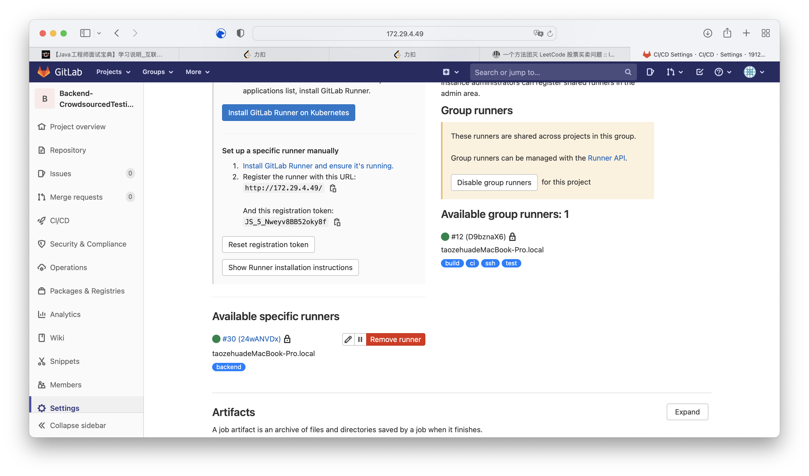
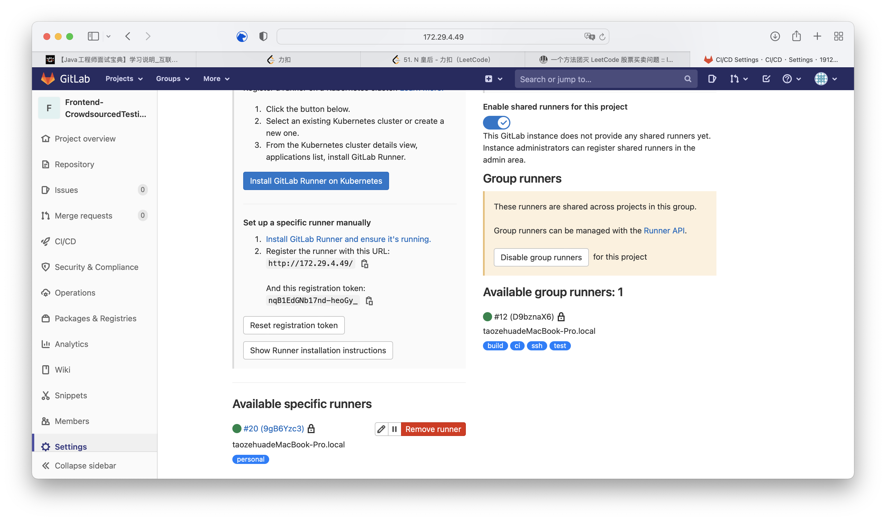

我们使用电脑本机配置了gitlab runner，使用远程服务器对产物进行部署

前端主分支为master、测试分支为test。**后端主分支为task，测试分支为master！！！！**
(测试分支的部署阶段需要手动触发)

* 主分支前端部署地址：124.222.139.8:8080
* 主分支测试报告生成地址：124.222.139.8:8081
* 主分支后端部署地址：124.222.139.8:8082
* 测试分支后端部署地址；124.222.139.8:8083
* 测试分支前端部署地址；124.222.139.8:8084
* 测试支测试报告生成地址：124.222.139.8:8085

前端在部署时除了脚本里的内容，还需要在远程服务器中使用docker命令进行部署（该命令只需要执行一次，因此没有在脚本中给出）
- 主分支前端部署时使用`docker run -p 8080:80 -d -v /usr/local/www/dist:/usr/share/nginx/html nginx`命令
- 测试分支前端部署时使用`docker run -p 8084:80 -d -v /usr/local/frontTest/dist:/usr/share/nginx/html nginx`命令

后端测试报告在部署时除了脚本里的内容，还需要在远程服务器中使用docker命令进行部署（该命令只需要执行一次，因此没有在脚本中给出）
- 主分支测试报告部署时使用`docker run -p 8081:80 -d -v /usr/local/testHtml:/usr/share/nginx/html nginx`
- 测试支测试报告部署时使用`docker run -p 8085:80 -d -v /usr/local/testHtml-test:/usr/share/nginx/html nginx`命令

前、后端使用自己创建的gitlab runner进行 CICD 的自动构建和发布。

